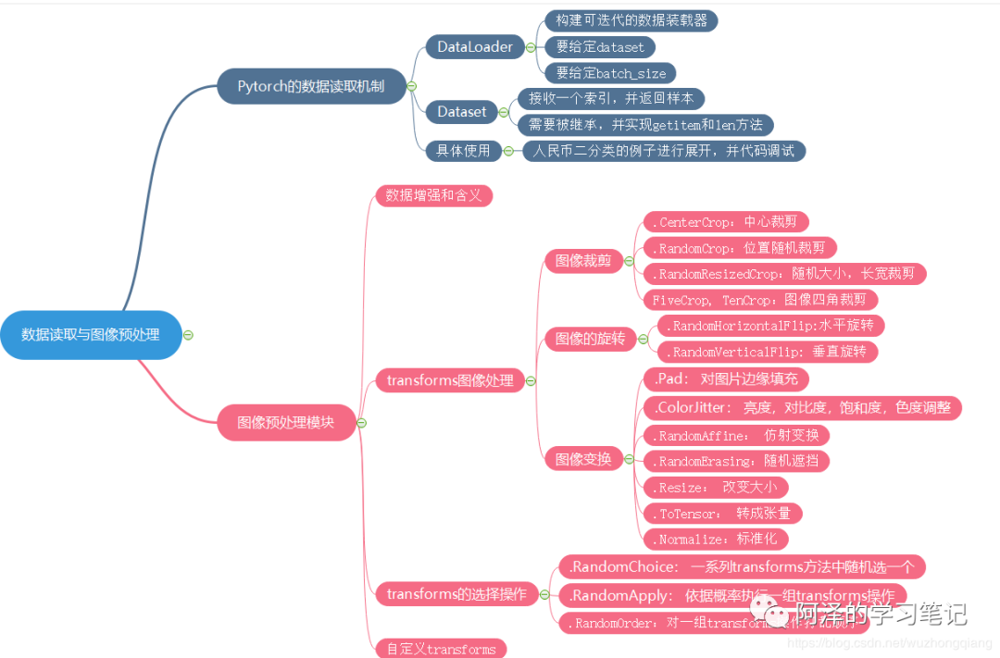
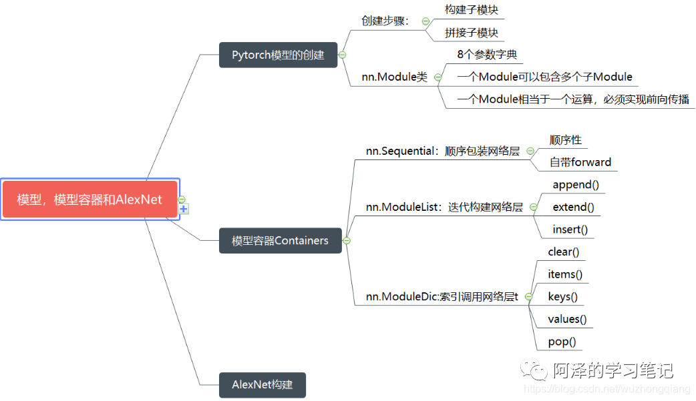
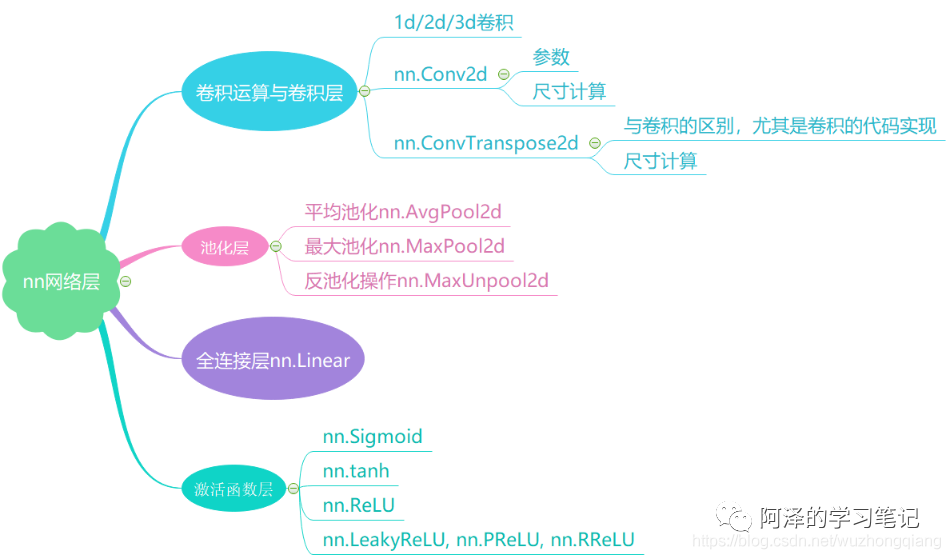
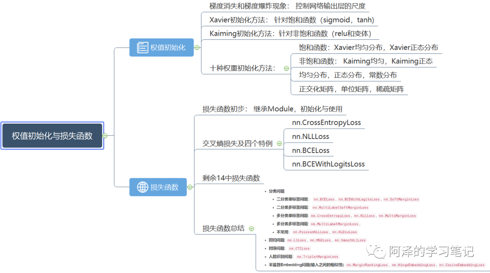

## 流程
- 数据 Data
- 模型 Model
    - 模型创建
        - 构建网络层
        - 拼接网络层
    - 权值初始化
- 损失函数 Loss function
- 优化器 Optimizer
- 迭代步骤
    - forward
    - compute loss
    - backward
    - update parameters
    - clear gradient

### 1. 数据载体张量与线性回归
- 

### 2. 动态图、自动求导与逻辑回归
- 
- 区分静态图和动态图
- 自动求导机制`torch.autograd.backward()`和`torch.autograd.grad()`
    - 梯度手动清零
    - 叶子节点不能进行原位`in-place`操作
    - 依赖叶子节点的节点默认进行求梯度操作
    
### 3. 数据读取机制与图像预处理模块
- 

### 4. Module和Containers源码解析
- 
- 模块构建机制
    - 先有一个目标网络的 `Module` 继承 `nn.Module` 这个基类
    - 然后该目标网络的 `Module` 里面又可以有很多的子模块，这些子模块同样也是继承于 `nn.Module`
    - 在这些 `Module` 的`__init__`方法中，会先通过调用父类的初始化方法进行`8`个属性的一个初始化
    - 子模块构建过程：第一步是初始化，然后被`__setattr__`这个方法通过判断 `value` 的类型将其保存到相应的属性字典里面去，然后再进行赋值给相应的成员。这样一个个的构建子模块，最终把整个大的 `Module` 构建完毕
- `nn.Module`
    - 一个 `module` 可以包含多个子 `module`(LeNet 包含卷积层，池化层，全连接层)
    - 一个 `module` 相当于一个运算， 必须实现 `forward()` 函数(从计算图的角度去理解)
    - 每个 `module` 都有 `8` 个字典管理它的属性(最常用的就是`_parameters`，`_modules` )

### 5. `nn`模块中的网络层
- 
- 卷积尺寸计算公式
    - 

### 6. 初始化与损失函数
- 
- Xavier权重初始化，有利于缓解带有sigmoid，tanh的这样的饱和激活函数的神经网络的梯度消失和爆炸现象，不过不适用于`Relu`激活函数

> Reference

[阿泽的学习笔记](https://mp.weixin.qq.com/mp/homepage?__biz=MzIwMDIzNDI2Ng==&hid=10&sn=25d0262fcb130258ed1a516f298c7ee4&scene=18#wechat_redirect)