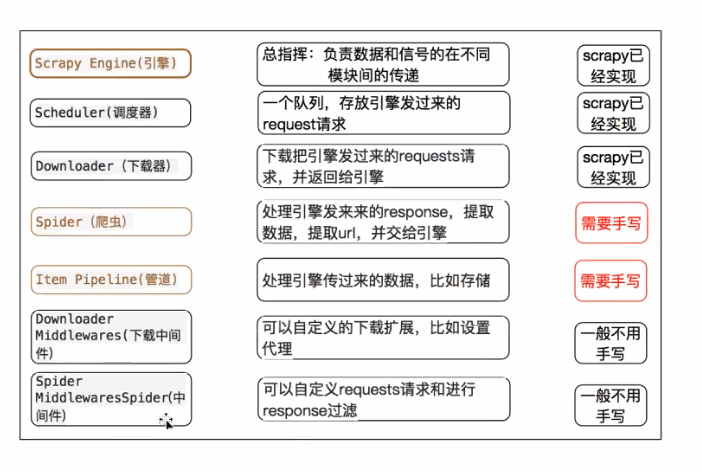

## 框架结构
- 
- 

## demo
- 创建scrapy项目
    - scrapy startproject `myspider`
- 生成爬虫
    - scrapy genspider itcast "itcast.cn"
- 提取数据
    - scrapy crawl `itcast`
    - 完善spider，使用xpath等方法
- 保存数据
    - pipeline中保存数据