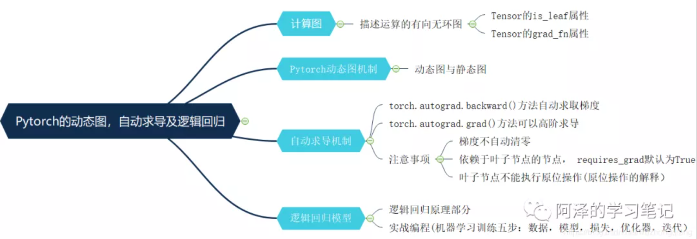

### 1. 数据载体张量与线性回归

### 2. 动态图、自动求导与逻辑回归

- 区分静态图和动态图
- 自动求导机制`torch.autograd.backward()`和`torch.autograd.grad()`
    - 梯度手动清零
    - 叶子节点不能进行原位`in-place`操作
    - 依赖叶子节点的节点默认进行求梯度操作

> Reference

[阿泽的学习笔记](https://mp.weixin.qq.com/mp/homepage?__biz=MzIwMDIzNDI2Ng==&hid=10&sn=25d0262fcb130258ed1a516f298c7ee4&scene=18#wechat_redirect)